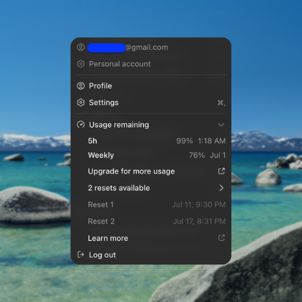

# codex-reset-credits

did you know your reset credits have expiration dates? 

see your Codex usage windows and reset-credit expiration times from the command
line.

why aren't they shown natively? no clue, but until it's addressed you can use this



`codex-reset-credits` is a small Python tool for checking how many Codex reset
credits are available, when each credit expires, and when the current usage
windows reset. It can also patch the Codex desktop "Usage remaining" menu to
show those reset-credit expiry rows in the app.

## Features

- Shows Codex usage-window reset times in your local timezone.
- Shows available reset credits and individual expiry times.
- Prints raw JSON for debugging or automation.
- Groups reset credits by known type/title/status.
- Can patch the Codex desktop menu so live expiry dates appear in "Usage
  remaining".
- Falls back to local session logs for basic usage-window data when the API is
  unavailable.

## Requirements

- Python 3.10 or newer
- A local Codex auth file at `~/.codex/auth.json`

Run Codex desktop or Codex CLI login first if that auth file does not exist.

## Installation

```bash
git clone https://github.com/MrFok/codex-reset-credits.git
cd codex-reset-credits
python3 -m pip install -e .
```

To run without installing:

```bash
git clone https://github.com/MrFok/codex-reset-credits.git
cd codex-reset-credits
PYTHONPATH=src python3 -m codex_reset_credits.cli status
```

## Quick Start

```bash
codex-reset-credits status
```

Example commands:

```bash
codex-reset-credits status
codex-reset-credits status --json
codex-reset-credits types
codex-reset-credits patch-app --dry-run
```

## Commands

### `status`

Print a human-readable summary of usage windows and reset credits.

```bash
codex-reset-credits status
```

Print the merged raw API response:

```bash
codex-reset-credits status --json
```

Use local session logs only:

```bash
codex-reset-credits status --no-api
```

### `types`

Show the reset-credit categories returned by the endpoint.

```bash
codex-reset-credits types
```

The command groups credits by category, endpoint `reset_type`, title, and
status. Current observed credits are `full` resets, but the classifier keeps
future `partial` reset credits separate if the endpoint starts returning them.

### `patch-app`

Patch the Codex desktop app menu to show live reset-credit expiry rows.

```bash
codex-reset-credits patch-app
```

The patch installs a live in-app fetcher. It does not bake the current reset
credits into the bundle; when Codex renders the usage menu, the injected rows
reuse Codex desktop's authenticated API client to request
`/wham/rate-limit-reset-credits` and populate from the current response. If that
request fails, the extra reset rows stay hidden.

Always dry-run first:

```bash
codex-reset-credits patch-app --dry-run
```

Patch a non-default `app.asar`:

```bash
codex-reset-credits patch-app --asar /path/to/app.asar
```

The patcher creates a `.bak` file next to the original unless `--backup` is
provided. Restart Codex desktop after patching.

## Auth

By default the CLI reads `~/.codex/auth.json`. Override it with:

```bash
codex-reset-credits --auth /path/to/auth.json status
```

The tool reads `tokens.access_token` and sends it as an HTTP `Authorization`
header. It does not print tokens.

## Windows support

The API checker should work on Windows if Codex stores auth at:

```text
%USERPROFILE%\.codex\auth.json
```

Use PowerShell like:

```powershell
py -m pip install -e .
codex-reset-credits status
```

The app patcher is macOS-first because the default Codex app bundle path is
macOS-specific:

```text
/Applications/Codex.app/Contents/Resources/app.asar
```

On Windows, the API checker is the portable part. The patcher may work if you
pass the correct `app.asar` path with `--asar`, but the Windows Codex desktop
install path and signing/update behavior still need verification.

## For Agents

Use a local virtual environment and keep the install editable:

```bash
git clone https://github.com/MrFok/codex-reset-credits.git
cd codex-reset-credits
python3 -m venv .venv
. .venv/bin/activate
python -m pip install -U pip
python -m pip install -e .
codex-reset-credits --help
codex-reset-credits status
```

If package installation is not available:

```bash
cd codex-reset-credits
PYTHONPATH=src python3 -m codex_reset_credits.cli status
PYTHONPATH=src python3 -m unittest discover -s tests
```

Do not print or log `~/.codex/auth.json`. `patch-app` no longer needs to read
live reset-credit data at install time; it only modifies the local app bundle.
Use `patch-app --dry-run` before modifying any Codex desktop `app.asar`.

## Caveats

- This uses private, undocumented ChatGPT backend endpoints. They may change.
- The app patcher edits a bundled Electron asset. App updates can replace it.
- Patching the installed app may affect code-signing validation. Keep the backup.
- If Codex is offline or the reset-credit endpoint fails, the patched app hides
  the extra reset-credit rows instead of showing stale data.
